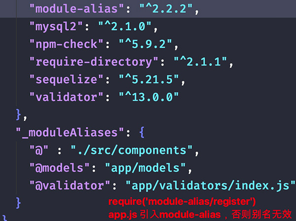

# koa-cms config

## 1 alias别名配置

1. `npm i module-alias`
2. [module-alias文档](https://www.npmjs.com/package/module-alias)
3. 尽量都配置别名，避免硬编码

```jsx
// app.js 引入 module-alias
require('module-alias/register')

// package.json 配置
"moduleAliases": {
    "@" : ".",
    "@root": ".", // Application's root
    "@models": "app/models",
    "@validator": "app/validators/index.js"
}
```


