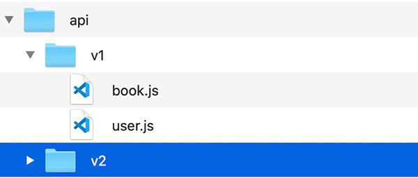

# API版本管理

1. API客户端兼容性多个版本，默认支持 3个版本
    - 例如： v1, v2, v3

2. API 携带版本号
    - 加在路径里面，把版本号放在路径里 `/v1/api/list`
    - 查询参数里面 `/api/list?version=v1`
    - http header头里面；复杂请求，触发 `OPTIONS`预请求

3. API版本的开闭原则：对代码的修改是关闭的；对代码的扩展是开放的
    - 尽量去扩展，而不是修改源代码
    - 对每个版本写一套路由，不要放在一起；分目录存放
