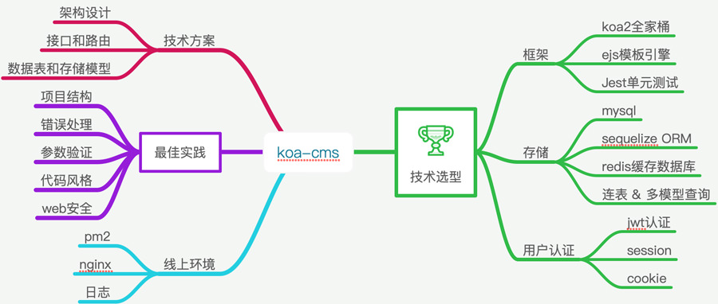
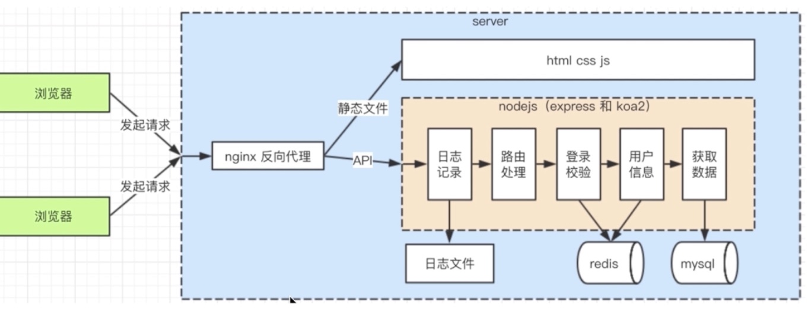
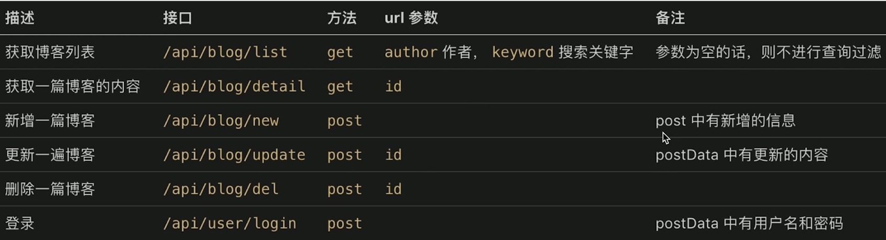
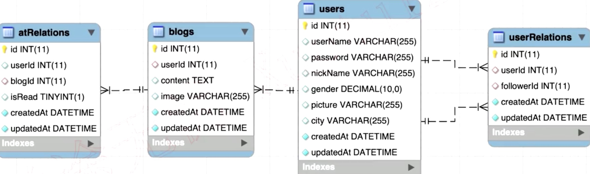
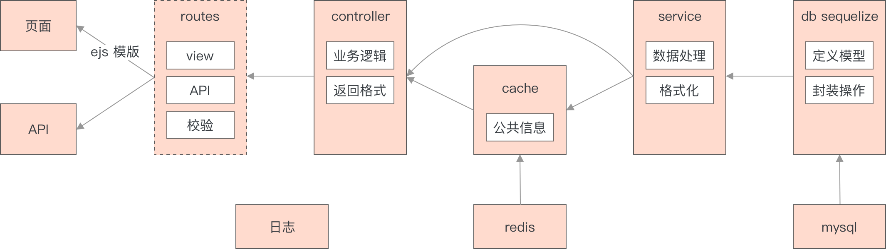

# koa2 打造服务端 CMS

> Author: 卢珑文 <br>
> Email: lulongwen@live.com <br>
> Wechat: 18915972355 <br>
> Website: www.lulongwen.com  <br>
> Github: www.github.com/lulongwen  <br>





## KOA-CMS 技术栈

> KOA-CMS 前后端分离的 Content Management System <br>
>
> 独立完成一个项目，自己完整的开发一个前后端项目


1. nodejs + npm + Koa + ES9 + Babel + Typescript + JWT
2. mysql + navicat + RestFul API
3. 微信开发者工具 + PostMan + nodemon + pm2
   1. nodemon 检测文件变化，自动重启 node服务
   2. cross-env 设置环境变量，兼容 mac，linux，win10
4. 系统设计，分层思路，接口设计思路
   - 渐进式开发，在已有功能上开发新功能，不是一步到位
   - 设计，抽离，分层
   - 如何设计 server 端架构，API 和路由，数据模型设计
   - 模板路由和 API设计
5. 服务器部署

```bash
npm i axios lodash npm-check require-directory validator sequelize
npm i basic-auth jsonwebtoken mysql2 bcryptjs
npm i koa-router koa-static koa-bodyparser
```


环境变量

```jsx
process.env.NODE_ENV
```


### CMS技术点

1. validator 参数校验
   - 每个请求都有一个唯一的 validator
   - Validator中间件来构建验证层

2. 全局异常处理中间件
   - http错误状态码

3. 路由自动注册 `require-directory`
   - 路由按照主题拆分；主题划分是渐进式，先找出核心主题
   - `app.js入口`导入子模块；子模块不应该调用入口文件；分层次，上层调用下层

4. Sequelize & Mysql
   - 服务端开发你是绕不过 mysql的
5. Web分层结构
   - model service logic
6. RestFul
   - web开发不考虑状态
   - 权限中间件


### 安全

1. 身份验证 httpbasicAuth
2. bcryptjs 密码加密
3. XSS
4. 真正的权限控制还是服务端，前端只是辅助展示


### 异常处理

1. 全局异常捕获
2. express内置异常处理
3. 自定义异常处理
4. 专门的 404异常处理 NotFound

```jsx
throw new Error('自定义异常')

app.use(notFound)
app.use(errorGlobal)
```


### 参数验证

1. GET
2. POST


### GIT

```bash
https://code.aliyun.com/groups/longwen-blog
```


### ssh

查看本地公钥

```bash
cd ~/.ssh
ls

# 如果已经存在 id_rsa.pub 就直接打开该文件，获取到公钥
subl id_rsa.pub

# 创建公钥
ssh-keygen -t rsa -C "你的邮箱"
```


## KOA-CMS 目录结构

```tree
app CMS系统代码
src 业务代码
```

2. CMS规范
3. 配置
   权限管理
4. 行为日志
5. 校验器
6. 令牌
7. 单元测试


## koa中间件

> 中间件，就是可插拔的功能函数

中间件是个函数，完整的结构有：err, req, res, next -> function

1. 异常
2. 处理一下业务功能，然后转交控制权 next
3. 响应请求，结束响应，当做路由的处理函数，例如参数的验证


### koa内置中间件

1. app 级别中间件，注册时，一定在最顶级使用
2. router级别中间件
3. 全局异常处理


### 第三方中间件

1. koa-router
2. koa-views，渲染 ejs模板
3. koa-static，静态文件服务
4. koa-json，解析请求中的 json对象
5. koa-bodyparser，解析 post请求的数据
6. koa-logger，格式化日志
7. koa-redis，连接 redis
8. koa-generic-session，生成session
9. koa-convert
10. **思考各个插件的实现原理？**


### 自定义中间件

1. login-check，检测 api请求的登录状态
2. login-redirect，检测请求中的登录状态
3. validator，post请求数据的 json schema验证


## koa2博客

1. 目标
   1. 开发一个博客CMS，具有博客的基本功能
   2. 首页，作者主页，博客详情页
   3. 登录页：登录的统一解决方案
   4. 管理中心，新建 & 编辑博客，
   5. 迭代功能：评论，微博功能
2. 需求分析
3. server端的技术方案
   1. 数据存储
   2. API接口设计


博客分层架构




### 博客技术点

1. API，数据存储，登录，日志
2. 安全，日志记录和日志分析
3. 中间件
4. http， stream，session，mysql，redis，nginx，pm2
5. 服务端开发思想


### 博客 API




## koa2微博

1. 框架：koa2，ejs模板，jest单元测试
2. 存储：mysql， sequelize，连表，多模型
3. 用户认证：session，jwt，redis缓存
4. 线上运维：pm2和多进程，nginx和反向代理，日志
5. 规范：eslint，inspect debug


### 微博路由

1. 注册 /register
2. 登录 /login
3. 首页 /index
4. 个人主页 /profile/:userId
5. @页面 /me
6. 广场 /square
7. 设置 /setting
8. 错误页 /error
9. 404 /*


### 用户路由

```jsx
// 用户路由
登录 /api/user/login
注册 /api/user/register
用户名是否存在 /api/user/isExist

// 设置路由
修改个人信息 /api/user/update/userInfo
图片上传 /api/upload/images
修改密码 /api/user/update/password
退出登录 /api/user/logout
```


### 微博路由

```jsx
// 首页
创建微博 /api/blog/create
图片上传 /api/upload/images
加载更多 /api/blog/loadmore/:index

// 个人主页
加载更多 /api/profile/loadmore/:userId/:index
关注 /api/profile/follow
取消关注 /api/profile/unfollow

// 广场页
加载更多 /api/square/loadmore/:index

// @页面
创建微博 /api/blog/create
图片上传 /api/update/images
加载更多 /api/me/loadmore/:index
```


### ejs组件

1. 全局的 header & footer
2. 发布博客输入框
3. 博客列表
4. 加载更多
5. 个人信息
6. 粉丝列表
7. 关注人列表


### mysql





## nodejs 最佳实践

1. 目录结构
2. 全局错误处理
3. 代码风格
4. 质量保证
5. 安全
6. 线上环境
7. 渐进式，在已有功能上开发新功能，不要一步到位
   1. 先设计，再开发，开发过程中，反复回顾设计，优化设计方案
   2. 系统设计，分层思路，接口设计思路，数据建模思路


### 分层设计

1. 架构设计
2. 页面（模板，路由），API接口，路由设计
3. 数据表，数据模型设计
4. **系统的设计 & 架构能力**，正是你要提升的地方


微博分层设计图




### 微博功能开发

1. 用户管理：登录，注册
2. 用户设置：修改基本信息，修改密码，退出登录
3. 个人主页：显示个人微博列表和个人信息，@关注列表
4. 广场页面：粉丝
5. 微博：创建微博，列表（首页，个人主页，广场页）
6. @功能：@某人，回复，接收 @到我的消息，@我的


## 为什么开发 KOA-CMS

1. CMS是前后端一体化的解决方案；是一个系统不可或缺的组成部分
    - 开发大多数都是操作和管理数据，然后展示界面，拒绝重复劳动，框架解决
    - 技术的积累和进阶，拒绝搬砖
    
2. 移动端主要浏览和展示数据，web端录入和管理数据，生产数据
    - 移动端数据录入的难度很大，需要放到 web端来做
    - web生产数据，多端展示数据

3. `PHP CMS` 基于模板渲染的架构，不能适应前后端分离
    - 服务端模板语言生成，增加开发的复杂度和学习成本
    - 技术的边界和范围

4. SPA适合做中后台管理系统开发，不需要 SEO
    - SEO需要 SSR服务端渲染
    - SPA开发 CMS 用户体验好

6. 如何做好一个产品
    - 商业性的项目才能驱动进步；做出有人用的产品，做出高质量的成品项目
    - 选择小而美的公司，技术的提升，必须有复杂的业务驱动
    - 以解决问题为目标，懂得取舍，卖东西都说自己的好


## 服务端开发

1. 服务稳定性
   1. 单个客户端可以意外挂掉，但服务端不能
   2. 不可用时长
   3. pm2 进程守候，服务挂掉，自动重启
2. 考虑内存和 CPU，优化和扩展
   1. server端要承载很多请求，CPU和内存都是稀缺资源
   2. stream写日志，redis存 session，优化CPU
3. 日志记录
   1. 记录日志，存储日志，分析日志
4. 安全
   1. server端可能遭受各种恶意攻击和误操作
5. 集群和服务拆分
   1. 扩展机器和服务拆分来承载大流量
6. 编程语言从来不是问题，重要的是开发思维
   1. 开发人员，总是受限于工作职位和思维


## 前端进阶提升

1. 接受即成的事实
2. 我并不认为我的能力和编程水平，学习能力比大厂的人差在哪里
3. 我还能做很多事情，未来有很大的进步空间
    - 能力不断提升，更多的职责，与人沟通做管理，亲自动手和实践
4. 综合素质：交流，管理，认知，学习，任务规划
5. 培养一个兴趣：摄影，写作，画画
6. 前后端分离缺点：削弱了技能的进阶，扼杀了成长，必须要进阶服务端
    - 掌握服务端，统领全局
    - 拒绝原地打转，玩溜一个技术栈，比如 vue
7. 自我解决问题，寻找答案的思考过程


## 陈述做过的项目

1. 你需要用尽可能简练的文字来描述项目的背景
2. 你在项目中承担的角色、参与项目的时长
3. 你用到的技术，以及你在项目中亮点等信息
4. 善于归纳，一针见血地发现问题或把一个问题说清楚