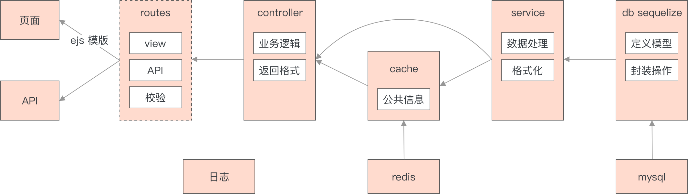
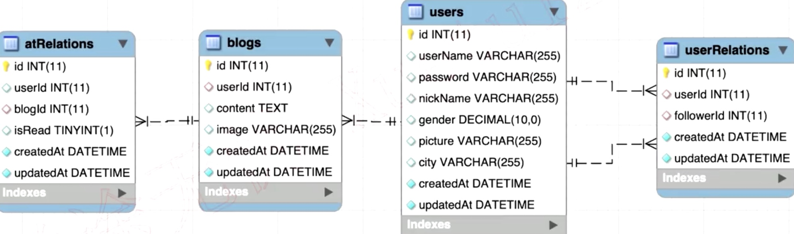

# koa-weibo

1. 框架：koa2，ejs模板，jest单元测试
2. 存储：mysql， sequelize，连表，多模型
3. 用户认证：session，jwt，redis缓存
4. 线上运维：pm2和多进程，nginx和反向代理，日志
5. 规范：eslint，inspect debug


## 分层设计

1. 架构设计
2. 页面（模板，路由），API接口，路由设计
3. 数据表，数据模型设计
4. **系统的设计 & 架构能力**，正是你要提升的地方


微博分层设计图




### 微博技术选型

1. 框架选择：koa2，ejs模板
   1. koa2，express，egg
   2. ejs，nunjucks模板引擎
   3. vue， react
2. 存储：mysql，sequelize
   1. MongoDB
   2. redis缓存数据库
3. 用户认证：redis，session，jwt
   1. 登录技术：session 域名统一
   2. jwt，前后端分离
4. 运维：pm2和多进程，nginx和反向代理，日志
5. 单元测试，jest


## mysql微博

1. PK primaryKey 主键

2. NN notnull 不能为空

3. AI autoIncrement 自动增加
4. UQ
5. BIN

6. default 默认

7. datatype




users.sql

```sql

```

blog.sql

```sql

```

@.sql

```sql

```


## 微博router

1. 注册 /register
2. 登录 /login
3. 首页 /index
4. 个人主页 /profile/:userId
5. @页面 /me
6. 广场 /square
7. 设置 /setting
8. 错误页 /error
9. 404 /*


### 用户路由

```jsx
// 用户路由
登录 /api/user/login
注册 /api/user/register
用户名是否存在 /api/user/isExist

// 设置路由
修改个人信息 /api/user/update/userInfo
图片上传 /api/upload/images
修改密码 /api/user/update/password
退出登录 /api/user/logout
```


### 微博路由

```jsx
// 首页
创建微博 /api/blog/create
图片上传 /api/upload/images
加载更多 /api/blog/loadmore/:index

// 个人主页
加载更多 /api/profile/loadmore/:userId/:index
关注 /api/profile/follow
取消关注 /api/profile/unfollow

// 广场页
加载更多 /api/square/loadmore/:index

// @页面
创建微博 /api/blog/create
图片上传 /api/update/images
加载更多 /api/me/loadmore/:index
```


### 微博组件

1. 全局的 header & footer
2. 发布博客输入框
3. 博客列表
4. 加载更多
5. 个人信息
6. 粉丝列表
7. 关注人列表


## 微博功能开发

1. 用户管理：登录注册功能
2. 用户设置：修改基本信息，修改密码，退出登录
3. 个人主页：显示个人微博列表和个人信息，@关注列表
4. 广场页面：粉丝
5. 微博：创建微博，列表（首页，个人主页，广场页）
6. @功能：@某人，回复，接收 @到我的消息，@我的


### 用户管理

1. 页面模板
2. loginCheck中间件


