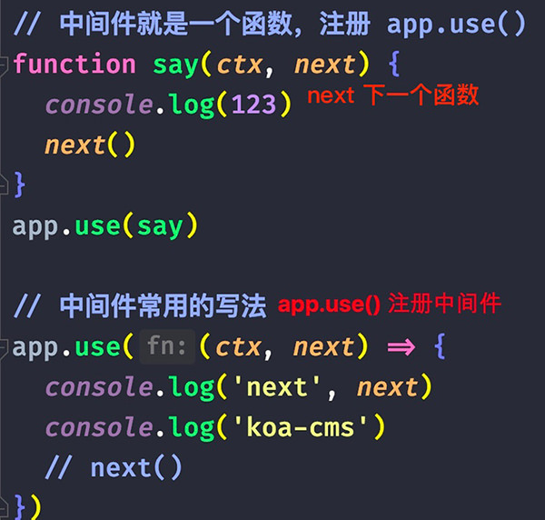
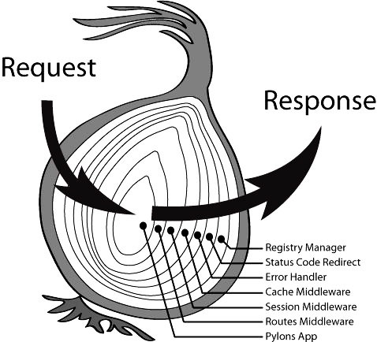
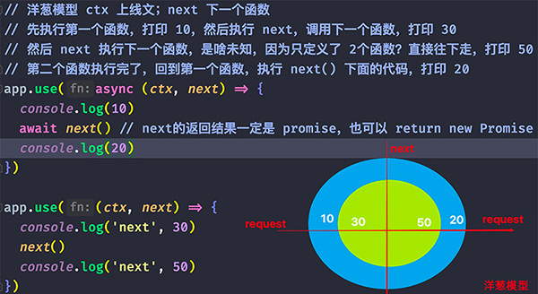
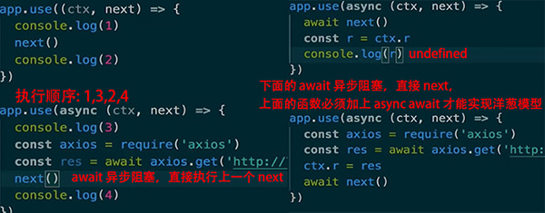

# koa 中间件核心机制

1. `const app = new Koa()` new出来的 app 是服务器运行实例
2. `app.use((ctx, next) => {})` 中间件都会传递2个参数 `ctx, next`
    - ctx 当前上下文
    - next 下一个中间件函数 调用next 触发下一个中间件函数

3. 核心的是 `request & response`，这俩可以对应到 Express 的 `req & res`
4. koa把 `request & response`集中到 ctx 里面进行管理，通过 `ctx.request` 和 `ctx.response` 访问


## 1 什么是中间件

1. 中间件就是一个函数，一个回调函数；定义一个中间件就是写一个函数
2. 注册 `app.use()`，只有注册之后，函数才能成为中间件
    - 一个应用程序可以注册多个中间件，默认执行第一个中间件
    - 后面的中间件执行，要自己调用 `next()`
    - await 前面必须要有 async

3. 中间件只在应用程序启动时初始化一次
    - 编写中间件，用中间件思维解决业务问题

4. 中间件可以 `return` 的；如果不是 promise会返回一个包装的 promise
    
5. 中间件是静态方式
   	validate 实例只有一个；中间件只在应用程序启动时初始化一次
   	每个请求都有一个唯一的实例
    - 中间层 针对微服务，聚合数据，返回到前端


### 中间件函数为什么要加上 `async`

1. 中间件不加 `async` 也会返回 `promise`，因为 koa内部封装了
2. 之所以加 `async`，是因为中间件函数的内部用了 `await`，如果不加 `async`会报错
3. 中间件如果不加 async，洋葱模型不一定按照顺序执行；如果内部有 await会阻塞线程

4. 洋葱模型的必要条件：要在每个中间件调用下一个中间件时，next() 前一定要加上 await
5. 中间件返回的数据必须绑定在 `ctx.body` 上，直接 return无效


### async function 本质上会返回一个 Promise

1. 简单理解为通过 `koa-compose`，以递归的方式实现了 Promise 的链式执行
2. 把可以递归调用的中间件数组都执行一遍，每个中间件都能拿到 ctx，
3. 因为 `async function` 的语法特性，可以中间件中，把执行权交给后面的中间件；
    - 这样逐层逐层交出去，最后再逐层逐层执行回来，
    - 就达到了请求沿着一条路进入，响应沿着同样的一条路反向返回的效果。

4. 服务端框架的核心流程，就是在整个 HTTP 进入到流出的过程中
    - 在流入的数据上采集所需要的参数；再向流出的数据结构上附加格式化数据
    - 在采集和附加的过程中，需要各个中间件的参与；比如记录日志，解析表单
    - 在这个过程中，用洋葱模型机制管理进场和出场顺序


next执行下一个中间件




## 2 洋葱模型

1. 洋葱模型以 `next()`为分界线，next之前的代码说明：后面的代码还没执行
2. `next()`后面的代码说明中间件已经执行完成



洋葱模型




## 3 koa 为什么要有洋葱模型？

1. 框架需要提供一套机制来保证中间件是有序执行；洋葱模型能保证所有中间件都执行成功
2. 为什么要保证中间件的执行顺序是洋葱模型？
    - 每个中间件函数都加上 `async`，next前面加上 `await` 能保证洋葱模型顺序；
    - 防止 await 异步阻塞，执行下一个next
    - 中间件的执行是有顺序的：依次执行；`async await` 能保证所有中间件都执行完

3. 例如中间件之间传递参数，要获取中间件的参数，必须要保证中间件已经执行完
    - 必须要写在 `next()` 后面
    
```js
app.use((ctx, next) => {
  console.log(100)
  next()
  console.log('ctx', ctx.data) // undefined
})

app.use(async (ctx, next) => {
  console.log(300)
  let data = await axios.get('http://www.lulongwen.com')
  ctx.data = data
  next()
  console.log(400)
})
```


## 4 Promise化

1. 中间件不加 `async` 也会返回 `promise`，因为 koa内部对结果封装了 Promise化
2. 中间件如果不加 `async`，洋葱模型不一定按照顺序执行；如果内部有 await会阻塞线程
3. 为了保证洋葱模型一致性：**所有中间件都加上 `async & await`**
4. 对资源操作，读写数据库，文件，http请求，都是异步操作

```js
app.use(async (ctx, next) => {
  console.log(100)
  // let a = next() // next 返回 包装的promise
  // a.then((res => {console.log(res)}))
  let a = await next() // await 代替 then回调
  console.log(200, a) // "koa500"
})
app.use(async (ctx, next) => {
  console.log(300)
  next()
  console.log(400)
  return 'koa500'
})
```


