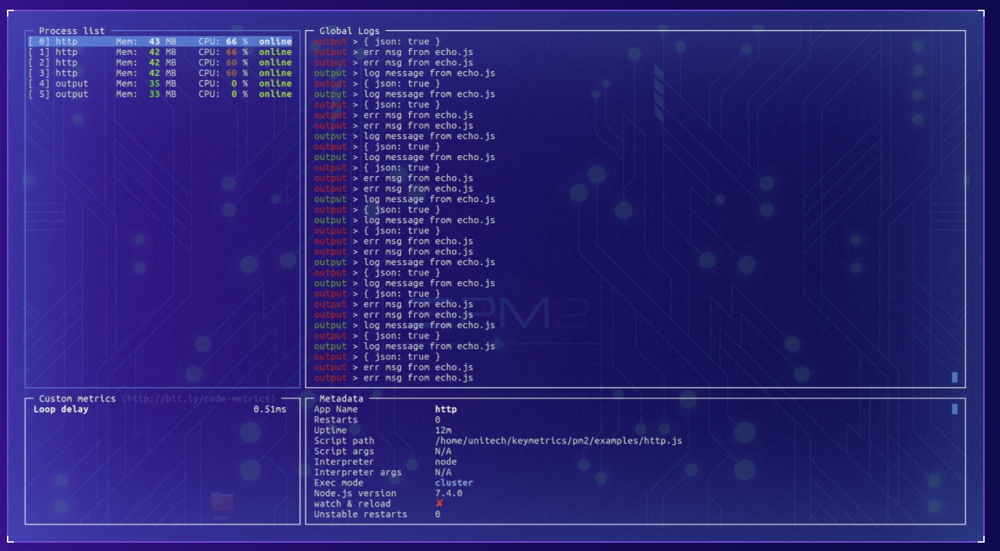

# nodejs 进程守护 pm2

1. 监控进程 守护进程
2. 日志监控 重启


## 1 pm2 命令

```bash
npm install pm2 -g

pm2 -v # 查看版本

pm2 start app.js # 启动

pm2 start app.js --name test # 启动并命名一个应用程序名

# 开启了watching，更新代码后，不用重载或重启项目即可以立即让更新的代码起作用
# 建议：这个适合在开发时用，可以省不少时间，生产环境下最好不要用
pm2 start app.js --name test --watch

pm2 monit # 打开实时监视器去查看资源占用情况

pm2 list # 列出pm2中所有项目

pm2 stop test # 根据App name关闭项目

# reload可以做到0秒宕机加载新的代码，
# restart则是重新启动，生产环境中多用reload来完成代码更新
pm2 reload test # 重载来加载新代码，也可以用重启

pm2 restart test

pm2 delete test # 从 pm2中删除
```


## 2 pm2 特性


## 3 pm2-monit




## 4 nginx 反向代理

```jsx
server {
    // 监听 80端口
    listen 80;
    server_name lulongwen.com;

    location / {
        // 请求转发到本地 3306端口
        include uwsgi_params;
        uwsgi_pass 127.0.0.1:3306
    }
}
```
